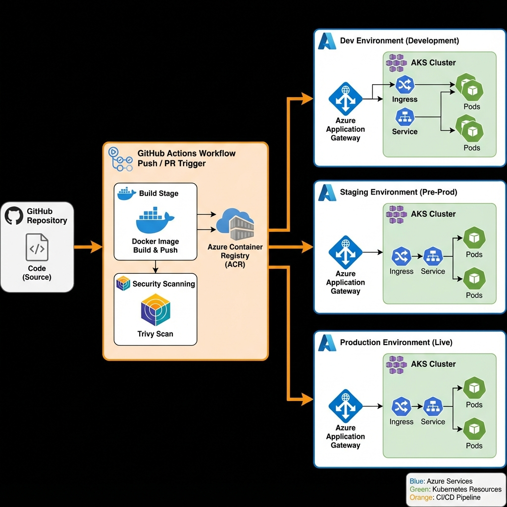

# AKS GitHub Actions CI/CD Pipeline

> **A production-ready Kubernetes deployment pipeline showcasing DevOps best practices with Azure Kubernetes Service (AKS) and GitHub Actions**

[](https://github.com/features/actions)
[](https://azure.microsoft.com/en-us/services/kubernetes-service/)
[](https://azure.microsoft.com/en-us/services/container-registry/)

## 📋 Overview

This repository demonstrates a complete CI/CD pipeline for deploying containerized applications to Azure Kubernetes Service (AKS) using GitHub Actions. It showcases modern DevOps practices including infrastructure as code, automated testing, security scanning, multi-environment deployments, and **one-command rollback capabilities**.

### Key Features

✅ **Automated CI/CD** - GitHub Actions workflow with build, test, and deploy stages  
✅ **Hybrid Approach** - Kustomize for manifest generation + Helm for deployment  
✅ **One-Command Rollback** - Full release history with instant rollback capability  
✅ **Multi-Environment** - Separate configurations for dev, staging, and production  
✅ **Security First** - Container vulnerability scanning with Trivy  
✅ **Infrastructure as Code** - Kubernetes manifests managed with Kustomize  
✅ **High Availability** - Pod anti-affinity, PodDisruptionBudget, and health checks  
✅ **Production Ready** - Resource limits, security contexts, and monitoring hooks  

## 🏗️ Architecture



The pipeline uses a **hybrid approach** combining Kustomize and Helm:
- **Kustomize** generates environment-specific manifests from base configurations
- **Helm** manages deployments with full release tracking and rollback capabilities

Each push triggers an automated workflow that builds, scans, generates manifests, and deploys to the appropriate environment with automatic rollback on failure.

**[📖 Detailed Architecture Documentation](docs/architecture.md)**

## 🚀 Quick Start

### Prerequisites

- Azure subscription with AKS cluster
- Azure Container Registry (ACR)
- GitHub repository with Actions enabled
- `kubectl`, `kustomize`, and `helm` installed locally (for testing)

### 1. Clone the Repository

```bash
git clone https://github.com/yourusername/AKS-GitHub-Actions-CI-CD.git
cd AKS-GitHub-Actions-CI-CD
```

### 2. Configure Azure Resources

Create an Azure service principal for GitHub Actions:

```bash
az ad sp create-for-rbac \
  --name "github-actions-aks" \
  --role contributor \
  --scopes /subscriptions/{subscription-id}/resourceGroups/{resource-group} \
  --sdk-auth
```

### 3. Set GitHub Secrets

Configure the following secrets in your GitHub repository settings:

| Secret Name | Description |
|------------|-------------|
| `AZURE_CREDENTIALS` | Azure service principal credentials (JSON output from above) |
| `ACR_USERNAME` | Azure Container Registry username |
| `ACR_PASSWORD` | Azure Container Registry password |

### 4. Update Configuration

Edit `.github/workflows/aks-cicd.yml` and update:
- `ACR_NAME`: Your Azure Container Registry name
- Cluster names and resource groups for each environment

Edit `k8s/overlays/*/kustomization.yaml` files to match your environment names and configurations.

### 5. Deploy

Push to the appropriate branch to trigger deployment:

```bash
git checkout -b develop
git push origin develop  # Deploys to dev environment
```

## 📁 Repository Structure

```
.
├── .github/
│   └── workflows/
│       ├── aks-cicd.yml          # Main CI/CD workflow (Helm + Kustomize)
│       └── README.md             # Workflow documentation
├── helm-chart/                   # Helm chart for deployment
│   ├── Chart.yaml                # Chart metadata
│   ├── values-dev.yaml           # Dev environment values
│   ├── values-staging.yaml       # Staging environment values
│   ├── values-prod.yaml          # Production environment values
│   ├── templates/
│   │   └── kustomize-manifests.yaml  # Template wrapper
│   └── .helmignore
├── k8s/
│   ├── base/                     # Base Kubernetes manifests
│   │   ├── deployment.yaml
│   │   ├── service.yaml
│   │   ├── ingress.yaml
│   │   ├── pdb.yaml
│   │   └── kustomization.yaml
│   └── overlays/                 # Environment-specific overlays
│       ├── dev/
│       ├── staging/
│       └── prod/
├── app/                          # Sample Node.js application
│   ├── src/
│   │   └── index.js
│   └── package.json
├── docs/                         # Documentation
│   ├── architecture.md
│   ├── HELM_GUIDE.md             # Helm usage and rollback guide
│   └── images/
├── Dockerfile                    # Multi-stage Docker build
└── README.md
```

## 🔄 CI/CD Pipeline

### Workflow Stages

1. **Build**
   - Checkout source code
   - Build Docker image with BuildKit
   - Tag with environment and commit SHA
   - Push to Azure Container Registry
   - Run Trivy security scan

2. **Deploy**
   - Authenticate with Azure
   - Set AKS cluster context
   - Generate Kustomize manifests
   - Deploy using Helm with atomic rollback
   - Verify deployment rollout
   - Display deployment status and history

3. **Rollback** (automatic on failure)
   - Detect deployment failure
   - Automatically rollback to previous revision
   - Verify rollback success
   - Display rollback status

### Environment Strategy

| Branch | Environment | Replicas | Resources |
|--------|------------|----------|-----------|
| `develop` | Development | 2 | 256Mi / 100m CPU |
| `staging` | Staging | 3 | 512Mi / 250m CPU |
| `main` | Production | 5 | 1Gi / 500m CPU |

**[📖 Workflow Documentation](.github/workflows/README.md)**

## 🔒 Security Features

- **Container Scanning**: Trivy scans for vulnerabilities before deployment
- **Non-Root Containers**: All containers run as non-root users
- **Security Contexts**: Dropped capabilities and read-only filesystems
- **Network Policies**: Namespace isolation (can be added)
- **RBAC**: Role-based access control for AKS resources
- **Secrets Management**: Kubernetes secrets for sensitive data

## 🛠️ Technology Stack

- **Container Orchestration**: Azure Kubernetes Service (AKS)
- **Container Registry**: Azure Container Registry (ACR)
- **CI/CD**: GitHub Actions
- **Deployment Tool**: Helm 3
- **Configuration Management**: Kustomize
- **Security Scanning**: Trivy
- **Ingress Controller**: Azure Application Gateway
- **Application**: Node.js Express API

## 📊 Kubernetes Resources

### Deployment
- Rolling update strategy
- Pod anti-affinity for distribution across nodes
- Liveness and readiness probes
- Resource requests and limits
- Security contexts

### Service
- ClusterIP type for internal communication
- Label selectors matching deployment
- Port mapping (80 → 8080)

### Ingress
- Azure Application Gateway integration
- SSL/TLS termination
- Health probe configuration
- Path-based routing

### PodDisruptionBudget
- Ensures minimum pod availability
- Protects against simultaneous terminations
- Critical for production stability

## 🧪 Testing Locally

### Build and run the application locally:

```bash
cd app
npm install
npm start
```

### Test with Docker:

```bash
docker build -t demo-api:local .
docker run -p 8080:8080 demo-api:local
```

### Validate Kubernetes manifests:

```bash
# Validate base manifests
kubectl apply --dry-run=client -k k8s/base/

# Validate environment overlay
kubectl apply --dry-run=client -k k8s/overlays/dev/
```

### Preview Kustomize output:

```bash
kustomize build k8s/overlays/dev/
```

### Test Helm deployment:

```bash
# Lint Helm chart
helm lint helm-chart/

# Dry-run Helm install
kustomize build k8s/overlays/dev/ > /tmp/dev-manifests.yaml
helm install demo-api-dev helm-chart/ \
  --namespace dev \
  --values helm-chart/values-dev.yaml \
  --set-file kustomizeManifests=/tmp/dev-manifests.yaml \
  --dry-run --debug
```

## 📈 Monitoring and Observability

### Health Endpoints

- **Liveness**: `GET /health/live` - Container is alive
- **Readiness**: `GET /health/ready` - Container is ready for traffic

### Recommended Monitoring Tools

- **Azure Monitor**: Container insights and metrics
- **Prometheus**: Metrics collection
- **Grafana**: Metrics visualization
- **Application Insights**: APM and distributed tracing

## 🔄 Rollback Procedures

### View Release History

```bash
# List all Helm releases
helm list --namespace dev

# View release history
helm history demo-api-dev --namespace dev
```

### Rollback to Previous Version

```bash
# Rollback to previous revision
helm rollback demo-api-dev --namespace dev

# Rollback to specific revision
helm rollback demo-api-dev 2 --namespace dev --wait

# Verify rollback
helm status demo-api-dev --namespace dev
kubectl get pods -n dev
```

**[📖 Complete Helm Rollback Guide](docs/HELM_GUIDE.md)**

## 🔧 Troubleshooting

### Common Issues

**Deployment Failed**
```bash
# Check Helm release status
helm status demo-api-dev --namespace dev

# View release history
helm history demo-api-dev --namespace dev

# Rollback to last working version
helm rollback demo-api-dev --namespace dev
```

**Image Pull Errors**
```bash
# Verify ACR secret exists
kubectl get secret acr-secret -n <namespace>

# Recreate if needed
kubectl create secret docker-registry acr-secret \
  --docker-server=<acr-name>.azurecr.io \
  --docker-username=<username> \
  --docker-password=<password> \
  --namespace=<namespace>
```

**Pod Not Starting**
```bash
# Check pod status
kubectl get pods -n <namespace>

# View pod logs
kubectl logs <pod-name> -n <namespace>

# Describe pod for events
kubectl describe pod <pod-name> -n <namespace>

# Force rollback if needed
helm rollback demo-api-dev --namespace dev --force
```

## 🚀 Future Enhancements

- **[🚀 Detailed Future Work & Roadmap](FUTURE_WORK.md)**
  - Horizontal Pod Autoscaler (HPA)
  - Network Policies & Security
  - Advanced Configuration Management
  - Service Mesh & GitOps strategies

## 📚 Additional Resources

- [Azure Kubernetes Service Documentation](https://docs.microsoft.com/en-us/azure/aks/)
- [Kubernetes Best Practices](https://kubernetes.io/docs/concepts/configuration/overview/)
- [GitHub Actions Documentation](https://docs.github.com/en/actions)
- [Kustomize Documentation](https://kustomize.io/)

## 📝 License

This project is licensed under the MIT License - see the [LICENSE](LICENSE) file for details.

## 🤝 Contributing

This is a portfolio project, but suggestions and improvements are welcome! Feel free to open an issue or submit a pull request.

---

**Built with ❤️ to showcase DevOps and Kubernetes expertise**
