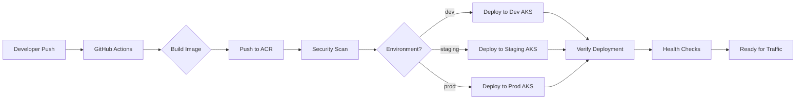

# Architecture Overview

## System Architecture


## Components

### 1. Source Control (GitHub)
- **Repository**: Contains application code, Kubernetes manifests, and CI/CD workflows
- **Branches**: 
  - `main` → Production environment
  - `staging` → Staging environment
  - `develop` → Development environment

### 2. CI/CD Pipeline (GitHub Actions)

#### Build Stage
- **Trigger**: Push to branches or pull requests
- **Actions**:
  1. Checkout source code
  2. Build Docker image using BuildKit
  3. Tag image with environment and SHA
  4. Push to Azure Container Registry
  5. Run security scan with Trivy
  6. Upload scan results to GitHub Security

#### Deploy Stage
- **Trigger**: Successful build completion
- **Actions**:
  1. Authenticate with Azure
  2. Set AKS cluster context
  3. Create namespace and secrets
  4. Apply Kustomize manifests
  5. Verify deployment rollout
  6. Display deployment status

### 3. Container Registry (Azure Container Registry)
- **Purpose**: Store and manage Docker container images
- **Features**:
  - Private registry for secure image storage
  - Geo-replication for high availability
  - Vulnerability scanning integration
  - Role-based access control (RBAC)

### 4. Kubernetes Cluster (Azure Kubernetes Service)

#### Environments
Each environment runs in its own namespace with environment-specific configurations:

| Environment | Namespace | Replicas | Resources |
|------------|-----------|----------|-----------|
| Development | `dev` | 2 | 256Mi / 100m CPU |
| Staging | `staging` | 3 | 512Mi / 250m CPU |
| Production | `production` | 5 | 1Gi / 500m CPU |

#### Kubernetes Resources

**Deployment**
- Manages pod replicas
- Rolling update strategy
- Pod anti-affinity for high availability
- Security contexts (non-root user)
- Resource limits and requests
- Health checks (liveness and readiness probes)

**Service**
- ClusterIP type for internal communication
- Exposes pods on port 80
- Label selector matches deployment pods

**Ingress**
- Azure Application Gateway Ingress Controller
- SSL/TLS termination
- Path-based routing
- Health probe configuration
- Private or public IP options

**PodDisruptionBudget**
- Ensures minimum availability during disruptions
- Protects against simultaneous pod terminations
- Critical for production stability

### 5. Networking

#### Ingress Flow
```
Internet/VNet → Azure Application Gateway → AKS Ingress → Service → Pods
```

#### Features
- **SSL/TLS**: Automatic HTTPS redirect
- **Health Probes**: Application Gateway monitors pod health
- **Load Balancing**: Distributes traffic across pod replicas
- **Path Routing**: Route different paths to different services

### 6. Security

#### Container Security
- Non-root user execution
- Read-only root filesystem option
- Dropped Linux capabilities
- Security context constraints

#### Image Security
- Trivy vulnerability scanning
- SARIF results in GitHub Security
- Private container registry
- Image pull secrets per namespace

#### Access Control
- Azure RBAC for AKS access
- Kubernetes RBAC for resource access
- Service principal authentication
- Namespace isolation

## Deployment Flow



## High Availability Features

### Pod Distribution
- **Anti-Affinity Rules**: Pods spread across different nodes
- **Multiple Replicas**: 2-5 replicas depending on environment
- **PodDisruptionBudget**: Maintains minimum available pods

### Health Monitoring
- **Liveness Probes**: Restart unhealthy containers
- **Readiness Probes**: Remove unready pods from service
- **Application Gateway Probes**: Backend health monitoring

### Rolling Updates
- **Strategy**: RollingUpdate with controlled rollout
- **Max Unavailable**: Limits simultaneous pod terminations
- **Max Surge**: Controls new pod creation rate

## Scalability

### Horizontal Scaling
- **Manual**: Adjust replica count in Kustomize overlays
- **HPA**: Horizontal Pod Autoscaler (can be added)
- **Cluster Autoscaler**: AKS node autoscaling

### Resource Management
- **Requests**: Guaranteed resources for scheduling
- **Limits**: Maximum resources to prevent resource exhaustion
- **QoS Classes**: Guaranteed, Burstable, or BestEffort

## Monitoring and Observability

### Recommended Tools
- **Azure Monitor**: Container insights and metrics
- **Prometheus**: Metrics collection
- **Grafana**: Metrics visualization
- **Application Insights**: Application performance monitoring
- **Azure Log Analytics**: Centralized logging

### Key Metrics
- Pod CPU and memory usage
- Request latency and throughput
- Error rates and status codes
- Deployment rollout status
- Node resource utilization

## Disaster Recovery

### Backup Strategy
- **Manifests**: Version controlled in Git
- **Images**: Stored in geo-replicated ACR
- **Configurations**: Declarative Kustomize overlays

### Recovery Process
1. Restore AKS cluster or create new cluster
2. Configure Azure credentials and networking
3. Run GitHub Actions workflow
4. Verify deployment and health checks

## Future Enhancements

- **Service Mesh**: Istio or Linkerd for advanced traffic management
- **GitOps**: ArgoCD or Flux for declarative deployments
- **Secrets Management**: Azure Key Vault integration
- **Autoscaling**: HPA and Cluster Autoscaler
- **Multi-region**: Active-active or active-passive deployments
- **Canary Deployments**: Progressive rollouts with traffic splitting
